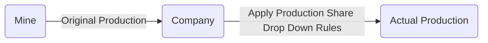

# Project Name

A `Company` has been receiving information about produced (`original`) material each year from a `Mine` but what they've realised is that over time the `actual` produced material they receive is different to what is reported by the `Mine`. The `actual` material changes based on the cumulative `original` produced tonnes over the course of the life-time of a `Mine`.

## Problem & Goal

To account for this discrepancy the `Company` has come up with `Production Share Drop Down` rules to describe how the `original` material will change over the years into `actual` material.

The `Company` needs to know how much `actual` produced material they are should expect based on the `Mine` values based on the `original` material and their `Production Share Drop Down` rules.

## Expected Results

These test cases are not exhaustive, so add as many as you see fit to cover all the possibilities you can think of. Think about what edge cases and scenarios could occur, if you're running out of time just list your assumptions.

Assuming the following `original` material in tonnes for the following test cases.

| 2022   | 2023   | 2024  | 2025   | 2026   |
| ------ | ------ | ----- | ------ | ------ |
| 1000 t | 1500 t | 900 t | 1000 t | 1200 t |

### Test Case #1

`Production Share Drop Down` Rules:

| Cumulative Mine Produced Start | Cumulative Mine Produced End | Company Production Share Percentage |
| ------------------------------ | ---------------------------- | ----------------------------------- |
| 0 t                            | 2500 t                       | 100%                                |
| 2500 t                         | Infinity                     | 50%                                 |

Expected `actual` Produced:

| 2022   | 2023   | 2024  | 2025  | 2026  |
| ------ | ------ | ----- | ----- | ----- |
| 1000 t | 1500 t | 450 t | 500 t | 600 t |

### Test Case #2

`Production Share Drop Down` Rules:

| Cumulative Mine Produced Start | Cumulative Mine Produced End | Company Production Share Percentage |
| ------------------------------ | ---------------------------- | ----------------------------------- |
| 0 t                            | 600 t                        | 100%                                |
| 600 t                          | Infinity                     | 25%                                 |

Expected `actual` Produced:

| 2022  | 2023  | 2024  | 2025  | 2026  |
| ----- | ----- | ----- | ----- | ----- |
| 700 t | 375 t | 225 t | 250 t | 300 t |

## Prerequisites

To run the application, you need to have the Bazel tool installed. You can download it from bazel.com. Follow the instructions provided on the website for installation.
Running the Application

To run the application, execute the following command in the terminal at the root of the project:

### bash

bazel run src/main:main (--verbose_failures)

## Solution

The application checks the original value based on predefined rules and selects the appropriate percentage. In cases where both rules are applicable, the edge case is handled by splitting and selecting the appropriate percentage bracket.
Test-Driven Development (TDD)

Refer to the TDD document used to achieve the solution. Test cases are written according to the TDD document to ensure the correctness of the implementation.
File Structure

The Solution file contains the logic to calculate the actual value. All other inputs will be provided by the user or the system, and these inputs will be handled by data classes accordingly. This ensures a modular and organized file structure for easy maintenance and understanding of the codebase.
